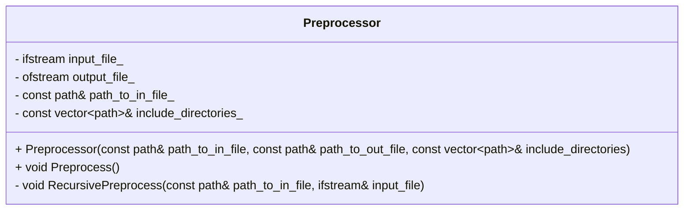

# Preprocessor

Учебный проект для закрепления навыков использования регулярных выражений. Представляет собой реализацию базового функционала стандартного препроцессора С++. А именно: поиск и inline раскрытие содрежания глобальных и локальных заголовочных файлов.

## Структура проекта


<br>

### Основные структурные элементы

Приложение содержит класс Preprocessor, который предоставляет открытый метод Preprocess, с помощью которого происходит рекурсивное расскрытие содержания заголовочных файлов входного файла. Все содержание входного файла с раскрытыми заголовочными файлами помещается в выходной файл. Пути до входного и выходного файла передаются заранее при создании объекта класса Preprocessor. Так же объекту передается набор include_directories, который представляет перечень путей до стандартных заголовочных файлов.

### Используемые библиотеки

Для поиска шаблонных текстовых форм команд препроцессора используется функционал библиотеки регулярных выражений (regex).

## Download

Скачать репозиторий можно с помощью команды:

```
git clone git@github.com:alexkozlovvv/cpp-preprocessor.git
```

## Usage

На данном этапе проект не предполагает интерактивного взаимодействия с пользователем поскольку отсутствует обработка входных команд. При запуске программа самостоятельно создает собственное тестовое окружение в виде директорий и файлов и выполняет препроцессинг входного файла a.cpp. Результат сохраняется в файле a.in. Встроенный тест проверяет правильность содержания выходного файла. 

## Дальнейшее развитие

Необходимо добавить возможность интерактивного взаимодействия с пользователем с помощью терминала.
Добавить тесты для модульного тестирования компонентов архитектуры.


