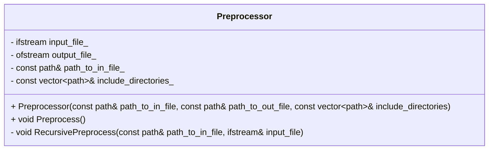

# Preprocessor

Учебный проект для закрепления навыков использования регулярных выражений. Представляет собой реализацию базового функционала стандартного препроцессора С++. А именно: поиск и inline раскрытие содрежания глобальных и локальных заголовочных файлов.

## Структура проекта


<br>

### Основные структурные элементы:
- 
- 

## Download

Скачать репозиторий можно с помощью команды:

```
git clone git@github.com:alexkozlovvv/cpp-preprocessor.git
```

## Usage

На данном этапе проект не предполагает интерактивного взаимодействия с пользователем поскольку отсутствует обработка входных команд. Сейчас они задаются статически в теле программы. 

Алгоритм работы программы:
- Создается объект поискового сервера;
- С помощью контруктора передаются стоп слова; 
- Далее создается объект очереди запросов.

## Дальнейшее развитие

Необходимо добавить возможность интерактивного взаимодействия с пользователем с помощью терминала.
Добавить тесты для модульного тестирования компонентов архитектуры.


